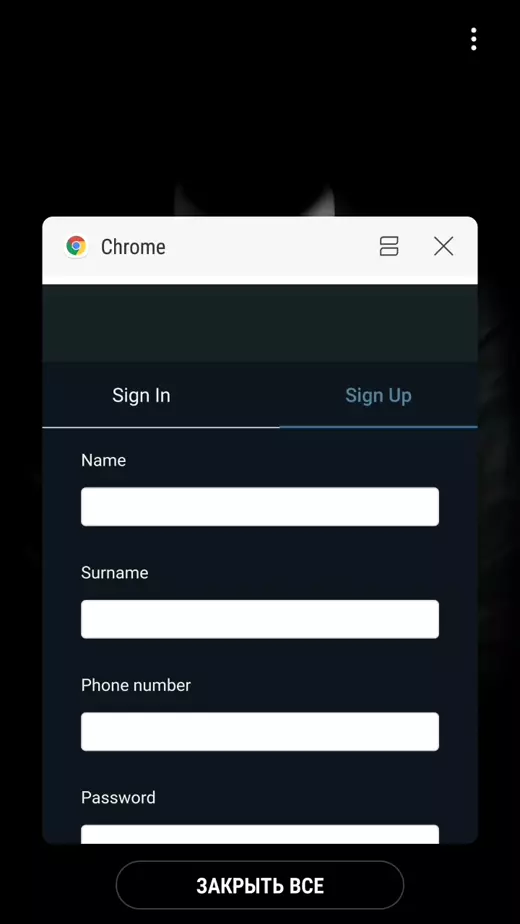
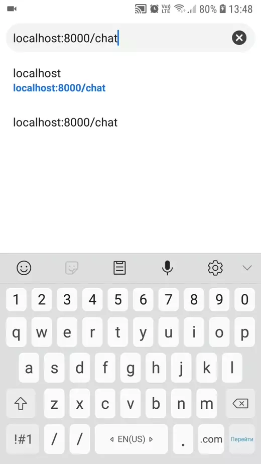

## REACTIVE PWA CHAT

This application is [PWA](https://developers.google.com/web/progressive-web-apps/) chat written on [Typescript](https://www.typescriptlang.org/) with [RxJS](https://rxjs-dev.firebaseapp.com/). Through the use of the [ServiceWorker](https://developers.google.com/web/fundamentals/primers/service-workers/), the application can work offline, and with [the web app manifest](https://developers.google.com/web/fundamentals/web-app-manifest/), it can launch via icon on main screen at mobile devices.

> There are not separate user dialogs at that moment - all users are in the same dialog(room).

> Also, there is [version](https://github.com/Burize/flutter-chat) of this chat written on Flutter.

#### User registration
------------



#### Launch app from main screen at mobile
------------


#### Launch app from desktop
------------ 


## Features
- SignIn/SignUp by login(phone number) and password;
- Editing user profile: name, phone, avatar;
- Sending/receiving message between user via sockets;
- Work offline;
- Launching as separate native app from mobile main screen (PWA);

### Used features
- [RxJS](https://rxjs-dev.firebaseapp.com/) for state management;
- [Typescript](https://www.typescriptlang.org/) for type checking;
- [Axios-observable](https://github.com/zhaosiyang/axios-observable) for handle http actions;
- [Antd](https://github.com/ant-design/ant-design/) as components kits.
- [Fp-ts](https://github.com/gcanti/fp-ts) to use abstractions that are available in most functional languages: Option, Either, Apply and etc.


## Getting Started

For work with api, you need deploy [server](https://github.com/Burize/chat-backend) for authentication and receiving message.

Then, set appropriate urls (`API_URL/WS_URL`) to api at `package.json`.

### NPM scripts
- ```npm i``` for installing dependencies
- ```npm run dev``` for development environment in watch mode
- ```npm run prod``` for production environment in watch mode
- ```npm run analyze:dev``` for bundle analyzing
